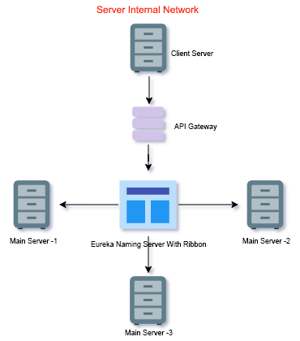

<table style="width:100%">
  <tr>
    <td><h1 align="center">Develop an API gateway with load balancer in JAVA</h3></td>
    <td></td>
  </tr>
</table>

[](https://www.oracle.com/java/technologies/javase-jdk11-downloads.html)
[](https://mvnrepository.com/artifact/org.springframework.cloud/spring-cloud-starter-netflix-eureka-server)
[](https://mvnrepository.com/artifact/org.springframework.cloud/spring-cloud-starter-netflix-zuul)


## About Project
  Nowadays every application is moving to micro-service architecture. In this architecture, API Gateway has an important role. Let's build a simple API gateway using java.

## Used Libraries

  * Netflix Eureka naming server 
  * Netflix Zuul
  * Ribbon
  * Feign
  
## Network Architecture
  <p align="center">
 	
  </p>

## Repository contains:-

* Load balancing application [netflix-eureka-naming-server]
* Server application [micro-service-server]
* Client application [micro-service-client]
* API gateway application [api-gateway-server]

## Steps to run applications

* Install JDK 11 or latest. 
* Clone the Project repository into local. 
* Run Load balancing application first. 
* Run The API gateway application.
* Then run Server application in two ports. 
* At last run Client application. 

## How it works

This architecture contains four different projects. 

### 1) Load Balancing Server

All client server communication will be done through this load balancing server. 

### pom.xml

* We are using <b>netflix-eureka-server</b> library to enable the communication between client and server. 

```xml
<properties>
	<java.version>11</java.version>
	<spring-cloud.version>Hoxton.SR4</spring-cloud.version>
</properties>

<dependencies>
  <dependency>
    <groupId>org.springframework.cloud</groupId>
    <artifactId>spring-cloud-starter-config</artifactId>
  </dependency>
  <dependency>
    <groupId>org.springframework.cloud</groupId>
    <artifactId>spring-cloud-starter-netflix-eureka-server</artifactId>
  </dependency>
</dependencies>
```

#### application.properties

```properties
spring.application.name=netflix-eureka-naming-server // application unique name
server.port=8761 // It will be the default port which eureka naming server

eureka.client.register-with-eureka=false
eureka.client.fetch-registry=false

```

#### NetflixEurekaNamingServerApplication.java

* <b>@EnableEurekaServer</b> annotation will allow the eureka server to control this application. 

```java 
@SpringBootApplication
@EnableEurekaServer // to enable the communication with Eureka server
public class NetflixEurekaNamingServerApplication {

	public static void main(String[] args) {
		SpringApplication.run(NetflixEurekaNamingServerApplication.class, args);
	}

}

```

* After running this application we can access the eureka server dashboard in following url

Link :- http://localhost:8761

<h3>Eureka Server Dashboard :- </h3>
<p align="center">
  
</p>

### 2) API gateway application

* This application will act as a middleware in between Server Application and Client Application. 
* All request going to the Server application will be filtered here.
* We are using <b>spring-cloud-starter-netflix-zuul</b> library to enable this filtering process.
* <b>netflix-eureka-client</b> is used to register the application with Eureka naming server. 

#### Zuul dependency

```xml 
<dependency>
	<groupId>org.springframework.cloud</groupId>
	<artifactId>spring-cloud-starter-netflix-zuul</artifactId>
</dependency>
```

#### pom.xml

```xml 
<properties>
		<java.version>11</java.version>
		<spring-cloud.version>Hoxton.SR6</spring-cloud.version>
	</properties>

	<dependencies>
		<dependency>
			<groupId>org.springframework.boot</groupId>
			<artifactId>spring-boot-starter-web</artifactId>
		</dependency>
		<dependency>
			<groupId>org.springframework.cloud</groupId>
			<artifactId>spring-cloud-starter-netflix-eureka-client</artifactId>
		</dependency>
		<dependency>
			<groupId>org.springframework.cloud</groupId>
			<artifactId>spring-cloud-starter-netflix-zuul</artifactId>
		</dependency>
```

#### application.properties

```properties

spring.application.name=api-gateway-server // application unique name
server.port=8765 // application will be running under this port
eureka.client.service-url.default-zone=http://localhost:8761/eureka // end point of load balancing server

```

#### ApiGatewayApplication.java

* <b>@EnableDiscoveryClient</b> annotation used to register the application with eureka server in the main class. 
* <b>@EnableZuulProxy</b> annotation used to connect the zuul library. 

```java
@SpringBootApplication
@EnableZuulProxy
@EnableDiscoveryClient
public class ApiGatewayApplication {

    public static void main(String[] args) {
		SpringApplication.run(ApiGatewayApplication.class, args);
	}

}
```

#### ZuulLoginFilter.java

* It is the class where all the APIs getting flittered.
* We extended one class named by "ZuulFilter".
* Four methods will be override from this class.
  * filterType() :- 
  The interruption time of a request will be decided in this method.<br>
  ***pre*** key is used to filter before reaching the Server application .<br>
  ***post*** key is used to filter when response came back from the Server application.<br>
  ***error*** key is used to filter any error happened.<br>
  * filterOrder() :-  To set the priority of the filter process.
  * shouldFilter() :- To decide whether the request is filter or not.
  * run() :-  This method will trigger after filtering process. So that we can write the business logic what ever we required.

```java 
@RestController
@RequestMapping("/client")
public class ZuulLoginFilter extends ZuulFilter  {

    @Override
    public String filterType() {
        return "pre"; // filter before request is executed
        // return "post"; filter after request is executed
        //return "error"; upon request error
    }

    @Override
    public int filterOrder() {
        return 1;
    }

    @Override
    public boolean shouldFilter() {
        return true;
    }

    @Override
    public Object run() throws ZuulException {
      logger.info("Request is filtered");
        HttpServletRequest httpServletRequest = RequestContext.getCurrentContext().getRequest();
        logger.info("request -> {} request uri -> {} ",
                httpServletRequest, httpServletRequest.getRequestURI());
        return null;
    }
}
```
* After running this application , instance of this application will be appear in the eureka server dashboard. 

### 3) Server application

* In-order to perform load distribution this application need to run in two instances. 
* <b>spring-cloud-starter-netflix-eureka-client</b> used to enable communication with Eureka naming server

```xml 
<dependency>
  <groupId>org.springframework.cloud</groupId>
  <artifactId>spring-cloud-starter-netflix-eureka-client</artifactId>
</dependency>
```

#### pom.xml

```xml
<properties>
  <java.version>11</java.version>
  <spring-cloud.version>Hoxton.SR4</spring-cloud.version>
</properties>

<dependencies>
  <dependency>
    <groupId>org.springframework.cloud</groupId>
    <artifactId>spring-cloud-starter-config</artifactId>
  </dependency>
  <dependency>
    <groupId>org.springframework.cloud</groupId>
    <artifactId>spring-cloud-starter-netflix-eureka-client</artifactId>
	</dependency>
</dependencies>
```

#### application.properties

```properties
spring.application.name=micro-service-server // application unique name
server.port=4000 // application will be running under this port

eureka.client.service-url.default-zone=http://localhost:8761/eureka // end point of load balancing server

```

#### MicroServiceServerApplication.java

* <b>@EnableDiscoveryClient</b> annotation to register the application with eureka server. 

```java
@SpringBootApplication
@EnableDiscoveryClient
public class MicroServiceServerApplication {

	public static void main(String[] args) {
		SpringApplication.run(MicroServiceServerApplication.class, args);
	}

}
```

#### Run Server application instance in two ports

First simply run the application as java application using main method. 
To run one more instance in another port we need to edit the <b>Run/Debug Configurations</b> In the IDE. 
<h3>In IntelliJ :- </h3>
<p> 
  Click on the <b>Edit Configuration</b> option, it will be available on the right top side of the menu bar. 
</p>
<p align="center">
  
</p>
  It will open a window as follows. Then enable <b>Allow parallel run</b> and press apply. 
 <p align="center">
  
</p>
  Now change the port in the property file as 4001. Then run once again. 
</p>
 
<h3>In In Eclipse :- </h3>
<p>  
  Right click on th main class -> click properties -> select main class -> click new button and add <b>-Dserver. port=4001</b> in the Vm Arguments as shown in the following images. 
</p>
<p align="center">
  
<p align="center">
  
</p>
</p>
  Then select the new configuration and run. Now these two instances of server will be appear in the eureka server dashboard. 
</p>

### 4) Client application

* This application will perform as consumer of APIs which is written in the main server. 
* It consumes the APIs from the both main server instance based on availability through load balancer. 
* We also use <b>netflix-eureka-client</b> library to communicate with load balancer application. 

#### OpenFeign

* We are using OpenFeign to consume APIs rather than using traditional HTTP libraries. 
* OpenFeign will act as a proxy in between server and client. 

```xml 
<dependency>
  <groupId>org.springframework.cloud</groupId>
  <artifactId>spring-cloud-starter-openfeign</artifactId>
</dependency>
```

#### Eureka Client & Ribbon

* Ribbon will do the automatic switching of servers in the client side
* Eureka will help us to dynamically add main server instances to the load balancer according to traffic. 

```xml 
<dependency>
  <groupId>org.springframework.cloud</groupId>
  <artifactId>spring-cloud-starter-netflix-ribbon</artifactId>
</dependency>
<dependency>
  <groupId>org.springframework.cloud</groupId>
  <artifactId>spring-cloud-starter-netflix-eureka-client</artifactId>
</dependency>

```

#### pom.xml

```xml 
<properties>
  <java.version>11</java.version>
  <spring-cloud.version>Hoxton.SR4</spring-cloud.version>
</properties>

<dependencies>
  <dependency>
    <groupId>org.springframework.cloud</groupId>
    <artifactId>spring-cloud-starter-config</artifactId>
    </dependency>
  <dependency>
    <groupId>org.springframework.cloud</groupId>
    <artifactId>spring-cloud-starter-openfeign</artifactId>
  </dependency>
  <dependency>
    <groupId>org.springframework.cloud</groupId>
    <artifactId>spring-cloud-starter-netflix-ribbon</artifactId>
  </dependency>
  <dependency>
    <groupId>org.springframework.cloud</groupId>
    <artifactId>spring-cloud-starter-netflix-eureka-client</artifactId>
  </dependency>
</dependencies>
```

#### application.properties

```properties
server.servlet.contextPath=/microservice
spring.application.name=micro-service-client // application unique name
server.port=5000 // application will be running under this port

eureka.client.service-url.default-zone=http://localhost:8761/eureka // end point of load balancing server

```

#### MicroServiceClientApplication.java

* <b>@EnableDiscoveryClient</b> annotation used to register the application with eureka server in the main class. 
* <b>@EnableFeignClients</b> annotation used to connect the feign library. 

```java
@SpringBootApplication
@EnableFeignClients("com.microservices.client")
@EnableDiscoveryClient
public class MicroServiceClientApplication {

    public static void main(String[] args) {
        SpringApplication.run(MicroServiceClientApplication.class, args);
    }

}
```

#### ClientController.java

* It is a ordinary rest controller class

```java 
@RestController
@RequestMapping("/client")
public class ClientController {

    @Autowired
    private ApiProxy apiProxy;

    @GetMapping("/technologyInfo/{platform}")
    public ResponseModel getTechnologyInfo(@PathVariable("platform") String platform) {

        // API calling using proxy interface and mapping into ResponseModel named Object.
        ResponseModel responseModel = apiProxy.retrieveTechnologyInfo(platform);

        return responseModel;
    }
}
```

#### ApiProxy.java

* Act as proxy class in between API and client. 
* <b>@FeignClient(name = "api-gateway-server")</b> annotation will enable the communication from the Client application to API gateway application. 
* <b>@RibbonClient(name = "micro-service-server")</b> annotation will tell the API gateway application to where the request has to go.
* <b>micro-service-server</b> should be the name of Server application.

```java 
@FeignClient(name = "api-gateway-server")
@RibbonClient(name = "micro-service-server")
public interface ApiProxy {

    @GetMapping("micro-service-server/server/technologyInfo/{platform}")
    ResponseModel retrieveTechnologyInfo(@PathVariable("platform") String platform);
}
```

#### ResponseModel.java

* It is a traditional model class. 

```java 
public class ResponseModel {

    private String tittle;
    private String platform;
    private String usedFor;
    private Short serverPort;
    --------
    ---
}
```

* After running client application, instance of this application also appear in the eureka server dashboard. 

## Result

* Now we can See totally 4 application instances are running in eureka server dashboard.
* Call client application API. 

URI :- http://localhost:5000/microservice/client/technologyInfo/java

* Response :- 

``` 
{"tittle":"Technology Stack","platform":"Java","usedFor":"Secured Web Services","serverPort":4000}
```

* Do refresh :-

``` 
{"tittle":"Technology Stack","platform":"Java","usedFor":"Secured Web Services","serverPort":4001}
```

* From the result we can understand that the api response is receiving from different servers by identifying port change. That means the requests are distributing in betweens ywo Server applications.
* And in the console of API gateway application we can see the message  ***"Request is filtered"***. That means API request also has been filtered by our application.

License
-------

    MIT License

    Copyright (c) 2020 Vishnu Viswambharan

    Permission is hereby granted, free of charge, to any person obtaining a copy
    of this software and associated documentation files (the "Software"), to deal
    in the Software without restriction, including without limitation the rights
    to use, copy, modify, merge, publish, distribute, sublicense, and/or sell
    copies of the Software, and to permit persons to whom the Software is
    furnished to do so, subject to the following conditions:

    The above copyright notice and this permission notice shall be included in all
    copies or substantial portions of the Software.
    
    THE SOFTWARE IS PROVIDED "AS IS", WITHOUT WARRANTY OF ANY KIND, EXPRESS OR
    IMPLIED, INCLUDING BUT NOT LIMITED TO THE WARRANTIES OF MERCHANTABILITY,
    FITNESS FOR A PARTICULAR PURPOSE AND NONINFRINGEMENT. IN NO EVENT SHALL THE
    AUTHORS OR COPYRIGHT HOLDERS BE LIABLE FOR ANY CLAIM, DAMAGES OR OTHER
    LIABILITY, WHETHER IN AN ACTION OF CONTRACT, TORT OR OTHERWISE, ARISING FROM,
    OUT OF OR IN CONNECTION WITH THE SOFTWARE OR THE USE OR OTHER DEALINGS IN THE
    SOFTWARE.

